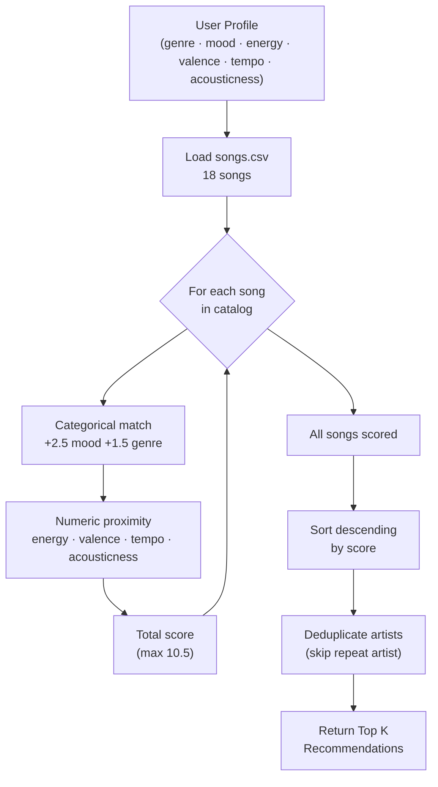
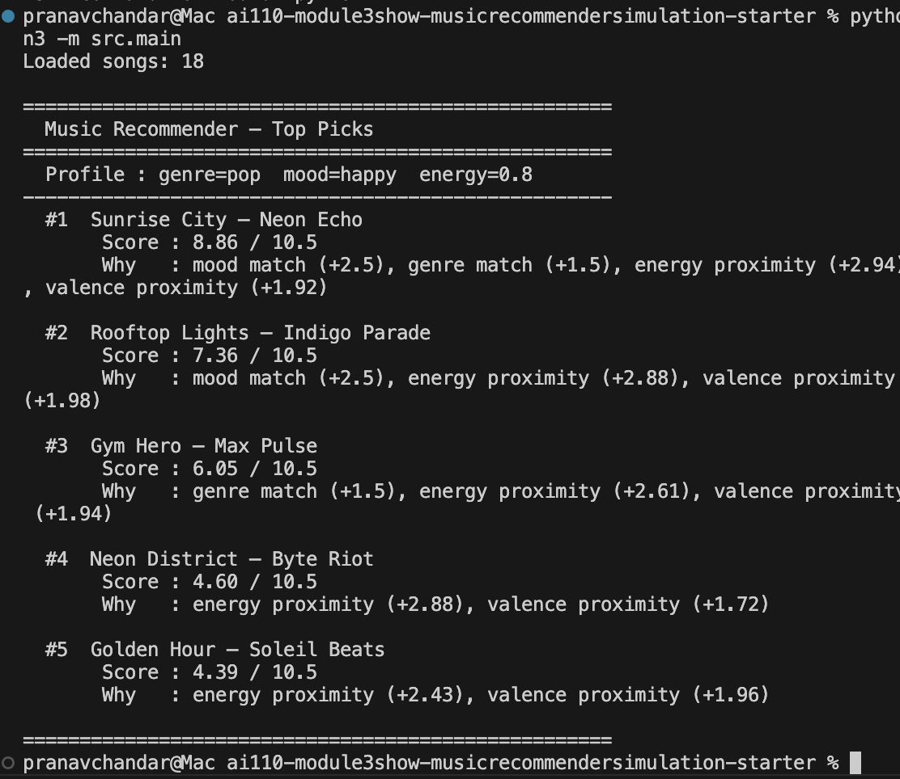

# 🎵 Music Recommender Simulation

## Project Summary

In this project you will build and explain a small music recommender system.

Your goal is to:

- Represent songs and a user "taste profile" as data
- Design a scoring rule that turns that data into recommendations
- Evaluate what your system gets right and wrong
- Reflect on how this mirrors real world AI recommenders

This simulation builds a content-based music recommender that scores each song by how closely its attributes match a user's taste profile. Unlike real-world systems such as Spotify's Discover Weekly — which layer collaborative filtering (learning from millions of other users) on top of audio analysis — this version focuses purely on song features and explicit user preferences. That tradeoff makes the system fully transparent: every recommendation score can be traced back to a specific feature match, which is not possible with a black-box neural model. The system prioritizes getting the emotional "vibe" right (energy and mood) over strict genre matching, so a lofi fan studying late at night gets calm, focused songs even if they span multiple genres.

---

## How The System Works

Real-world recommenders like Spotify combine two strategies: **collaborative filtering** (finding users with similar taste and recommending what they liked) and **content-based filtering** (analyzing a song's own audio attributes). This simulation uses content-based filtering only — it scores songs by measuring how close each attribute is to what the user prefers. The closer a song's energy, valence, mood, and genre are to the user's profile, the higher its score. Songs are then ranked by total score and the top results are returned, with a rule to avoid recommending two songs from the same artist in a row. This approach prioritizes the emotional "vibe" match (energy + mood) over strict genre alignment, reflecting how listeners often cross genre boundaries when the feel is right.

### `Song` Features

Each song in the catalog is described by these attributes:

| Feature | Type | What It Captures |
|---|---|---|
| `genre` | categorical | Broad style (pop, lofi, rock, ambient, jazz, synthwave, indie pop) |
| `mood` | categorical | Emotional intent (happy, chill, intense, relaxed, focused, moody) |
| `energy` | float 0–1 | Loudness and intensity |
| `tempo_bpm` | integer | Pace in beats per minute (normalized to 0–1 for scoring) |
| `valence` | float 0–1 | Musical positivity — high = happy/uplifting, low = dark/melancholic |
| `danceability` | float 0–1 | Rhythmic drivability |
| `acousticness` | float 0–1 | Organic/live feel vs. electronic production |

### `UserProfile` Features

The user profile stores the listener's preferences along the same dimensions:

- `preferred_genre` — the user's go-to genre (categorical)
- `preferred_mood` — the mood they are seeking right now (categorical)
- `preferred_energy` — their target energy level, 0.0–1.0
- `preferred_valence` — how happy or dark they want the music, 0.0–1.0
- `preferred_tempo` — preferred BPM (normalized before scoring)
- `preferred_acousticness` — preference for organic vs. electronic sound

### How the `Recommender` Scores Songs

Each song receives a score out of a maximum of 10.5 points:

```
score = (mood match × 2.5)
      + (genre match × 1.5)
      + (energy proximity × 3.0)
      + (valence proximity × 2.0)
      + (tempo proximity × 1.0)
      + (acousticness proximity × 0.5)
```

Proximity for numeric features = `1 - |song_value - user_preference|`, so closer always scores higher.

### How Songs Are Chosen

All songs are scored, sorted descending by total score, and the top N are returned — skipping any song whose artist already appeared in the results to ensure variety.

### Algorithm Recipe (Summary)

| Rule | Points |
|---|---|
| Mood match (exact) | +2.5 |
| Genre match (exact) | +1.5 |
| Energy proximity `1 - |song - user|` | up to +3.0 |
| Valence proximity `1 - |song - user|` | up to +2.0 |
| Tempo proximity (normalized BPM) | up to +1.0 |
| Acousticness proximity | up to +0.5 |
| **Max possible score** | **10.5** |

**Rationale for weights:** Energy is weighted highest among numeric features (3.0) because perceived intensity is the most immediate emotional signal when someone presses play. Mood (2.5) outweighs genre (1.5) so that a chill lofi song and a chill jazz track can both surface for a relaxed listener, even if the genre differs. Genre still matters — it prevents wildly mismatched styles — but it plays a supporting role.

### Data Flow



### Expected Biases

- **Genre dominance at the margins:** Two songs with the same mood but different genres can be separated by only 1.5 points — meaning a near-perfect genre match can edge out a better emotional fit. Users who listen across genre lines may get repetitive results.
- **Energy over-representation:** Energy carries 3.0 of 10.5 possible points (~29 %). A high-energy user will almost never see calm songs, even if mood and genre would otherwise fit.
- **Catalog skew:** With 18 songs the dataset over-represents chill/lofi and under-represents genres like blues, metal, and classical. Those genres will rarely surface regardless of user preference.
- **No listening history:** Every session starts cold — past plays, skips, and repeats are ignored, so the system cannot learn or adapt.

---

## Getting Started

### Setup

1. Create a virtual environment (optional but recommended):

   ```bash
   python -m venv .venv
   source .venv/bin/activate      # Mac or Linux
   .venv\Scripts\activate         # Windows

2. Install dependencies

```bash
pip install -r requirements.txt
```

3. Run the app:

```bash
python -m src.main
```

### Running Tests

Run the starter tests with:

```bash
pytest
```

You can add more tests in `tests/test_recommender.py`.

---

## Terminal Output

CLI output for the default `pop / happy / energy 0.8` profile:



---

## Experiments You Tried

Use this section to document the experiments you ran. For example:

- What happened when you changed the weight on genre from 2.0 to 0.5
- What happened when you added tempo or valence to the score
- How did your system behave for different types of users

---

## Limitations and Risks

Summarize some limitations of your recommender.

Examples:

- It only works on a tiny catalog
- It does not understand lyrics or language
- It might over favor one genre or mood

You will go deeper on this in your model card.

---

## Reflection

Read and complete `model_card.md`:

[**Model Card**](model_card.md)

Write 1 to 2 paragraphs here about what you learned:

- about how recommenders turn data into predictions
- about where bias or unfairness could show up in systems like this


---

## 7. `model_card_template.md`

Combines reflection and model card framing from the Module 3 guidance. :contentReference[oaicite:2]{index=2}  

```markdown
# 🎧 Model Card - Music Recommender Simulation

## 1. Model Name

Give your recommender a name, for example:

> VibeFinder 1.0

---

## 2. Intended Use

- What is this system trying to do
- Who is it for

Example:

> This model suggests 3 to 5 songs from a small catalog based on a user's preferred genre, mood, and energy level. It is for classroom exploration only, not for real users.

---

## 3. How It Works (Short Explanation)

Describe your scoring logic in plain language.

- What features of each song does it consider
- What information about the user does it use
- How does it turn those into a number

Try to avoid code in this section, treat it like an explanation to a non programmer.

---

## 4. Data

Describe your dataset.

- How many songs are in `data/songs.csv`
- Did you add or remove any songs
- What kinds of genres or moods are represented
- Whose taste does this data mostly reflect

---

## 5. Strengths

Where does your recommender work well

You can think about:
- Situations where the top results "felt right"
- Particular user profiles it served well
- Simplicity or transparency benefits

---

## 6. Limitations and Bias

Where does your recommender struggle

Some prompts:
- Does it ignore some genres or moods
- Does it treat all users as if they have the same taste shape
- Is it biased toward high energy or one genre by default
- How could this be unfair if used in a real product

---

## 7. Evaluation

How did you check your system

Examples:
- You tried multiple user profiles and wrote down whether the results matched your expectations
- You compared your simulation to what a real app like Spotify or YouTube tends to recommend
- You wrote tests for your scoring logic

You do not need a numeric metric, but if you used one, explain what it measures.

---

## 8. Future Work

If you had more time, how would you improve this recommender

Examples:

- Add support for multiple users and "group vibe" recommendations
- Balance diversity of songs instead of always picking the closest match
- Use more features, like tempo ranges or lyric themes

---

## 9. Personal Reflection

A few sentences about what you learned:

- What surprised you about how your system behaved
- How did building this change how you think about real music recommenders
- Where do you think human judgment still matters, even if the model seems "smart"

